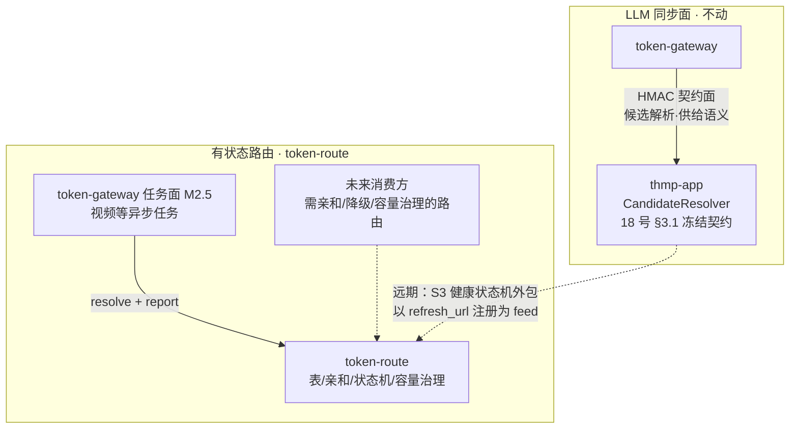
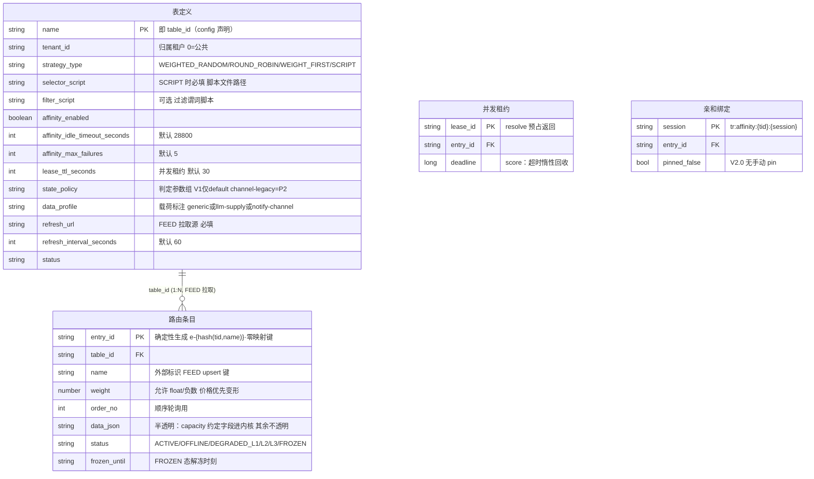
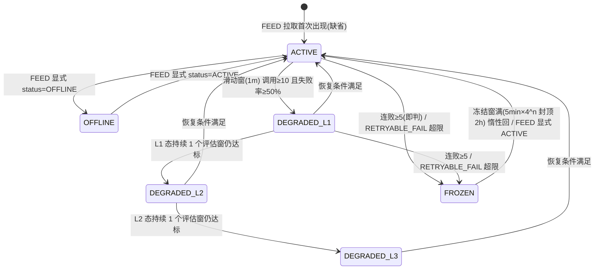

# token-route 通用路由服务设计

## 1. 基础信息

| 项 | 内容 |
|---|---|
| 项目 | token-route（funcommons 仓族 · 通用路由微服务） |
| 方案代号 | token-route |
| 文档状态 | 草稿（待评审；P0 产出，立项未启动） |
| 创建日期 | 2026-08-31 |
| 架构师 / Tech Lead | justin |
| 规范依据 | mc-doc-arch v1.0 / mc-doc-api v1.0 |
| 关联文档 | 本仓配套：`02_接口契约` / `03_数据设计` / `04_流程时序图` / `05_脚本引擎规格` / `07_实施计划` / `08_复用扩展方案` / `docs/用户文档/`（快速开始 / 消费方接入 / 管理与运维 / 配置手册 / 最佳实践 / FAQ，仿 GVP 结构）；跨仓：MMagiX `documents/12_microservices-architecture-design.md`（ms-split）、MMagiX `procurement/documents/` 18 号 THMP 契约、MMagiX `documents/路由流程设计.md`（渠道路由现网方案） |

### 修订历史

| 版本 | 日期 | 作者 | 说明 |
|---|---|---|---|
| V1.0 | 2026-08-31 | justin | 初版草稿（能力边界定稿 + 五处边界修正决议） |
| V1.1 | 2026-08-31 | justin | 去实体表：纯 Redis 状态面 + ingest 推入一等公民（真源铁律），部署 = app + Redis only |
| V1.2 | 2026-08-31 | justin | 去 push：删接入面与回调投递，纯拉取 + refresh 即时接口 + ver 版本戳传播；补 §2.4 通用性评估 |
| — | 2026-08-31 | justin | 文档自 MMagiX `documents/13_token-route-design.md` 平移至本仓 `docs/开发文档/01_设计方案.md`（正文不变，仅跨仓引用加仓名限定） |
| V1.3 | 2026-08-31 | justin | 开发前文档齐套：02 接口契约 / 03 数据设计 / 04 流程时序图 / 05 规则 DSL 规格 / 06 配置文档 / 07 实施计划 / 用户手册×2 |
| V1.4 | 2026-08-31 | justin | 鉴权简化三模式（内网微服务定位）：none/apikey/jwt，无凭证签发/轮换；删 HMAC、接入方凭证、跨租户拦截 |
| V1.5 | 2026-08-31 | justin | 采纳 08 号复用扩展方案：状态机判定参数化（state_policy 双预设）/ DSL 数值 helper / data_profile 载荷标注 / OpenAPI 导出件 |
| V2.0 | 2026-08-31 | justin | **核心流程重定义（四项拍板）**：① **全部表走 FEED + 表壳 config 种子化**——零管理写面（admin CRUD / 快照重推 / 手动 pin 全删，仅存只读 ops 查询面），换表 = 改配置滚动重启 ② **条目容量治理进内核**——上游限速/限并发作为 resolve 状态过滤维度，lease_id 预占/释放/超时回收 + 双速率桶；**调用方/用户·key 限流明确不在本项目范围** ③ **脚本策略提前 V1**——Groovy 沙箱统一引擎（过滤谓词 + 集合级选择器），替代 SpEL 表达式 DSL ④ **resolve 返回收窄** `{entry_id, data_json, lease_id}`——删 ver / fallbacks / SDK SWR 缓存（预占直连模式下冗余）；信号升级三态 report（SUCCESS / RETRYABLE_FAIL / DISABLE_FAIL + rate_units）；02~08 / README / 用户手册全链同步重写 |
| V2.1 | 2026-08-31 | justin | 评审收口：report 三态统一**全记账**（速率桶=窗口记账非「扣减」，DISABLE_FAIL 也计、调用前拒绝传 rate_units=0）；entry_id 定义为**确定性 ID**（`e-{hash(tid,name)}`，零映射键）；冷启动回源触发条件钉死（键不存在→单飞回源·空集→TABLE_EMPTY）；**channel-legacy 预设降级 P2**（V1 仅 default）；亲和脱离统一**惰性**语义（无反向索引不扫描）；report session_id = DISABLE_FAIL 本会话即时脱离；声明不支持 Redis Cluster + 时钟源 |

---

## 2. 背景与定位

### 2.1 决议链回顾

| 轮次 | 议题 | 结论 |
|---|---|---|
| 1 | THMP 路由能力是否独立成服务 | 否——服务本体 = THMP 契约面 `/v1/candidates/resolve`（契约已冻结，18 号 §3.1，CCB 防线），不拆 |
| 2 | token-route-sdk | 形态 = 客户端接入件；V2.0 起收缩为**薄 HTTP 客户端 + report 批量器**（预占直连模式无本地缓存） |
| 3 | token-route 能力边界 | 通用**有状态路由**服务：路由表/策略/条目 + 会话亲和 + 条目状态机 + 结果回填，与 THMP resolve **分层共存，不是替代** |
| 4 | V2.0 核心流程重定义 | 全 FEED 数据面 + config 种子化表壳（零管理写面）；容量治理（上游限速/限并发）进内核；脚本（Groovy 沙箱）进 V1；resolve 返回收窄。§3.2 ⑦~⑩ |

### 2.2 三问结论（立项依据）

| 问 | 结论 |
|---|---|
| 价值 | 亲和绑定、集中状态机、**条目容量治理**是消费方各自兜不住的服务型能力（需集中状态）；LLM 单消费方阶段价值 < 成本，兑现依赖第二消费方 |
| 可行 | 高——约 70% 为既有件重组（§8 复用清单；Groovy 沙箱借 MMagiX groovy-engine 先例）；新写面 = 亲和存储 + 集中状态机 + 容量记账 + refresh 拉取 + config 加载 |
| 合理 | 边界设计成立；结构问题（与 THMP 关系 / 数据写方 / 租户模型 / 容量记账归属）§3 逐项落定 |

### 2.3 定位：与既有路由的三层关系

- **LLM 面主链路不动**：THMP resolve 承接（供给语义逐租户 key 密文 / 成本缺失 / 归属过滤——静态条目数据装不下，无法通用化）。
- **token-route 管有状态路由**：任务面（异步任务轮询必须回同一上游 → 亲和刚需）与未来需要亲和/降级/容量治理的路由表。
- **12 号 model-svc 的分组路由不受影响**：MMagiX LLM 订阅平台 channel 分组路由，不在本方案范围。
- **远期收敛点**：THMP S3 健康状态机可采用 token-route 条目状态机（THMP 以 refresh_url 注册为动态 feed）。

### 2.4 通用性与可复用性评估

| 目标 | 可复用性 | 判定 |
|---|---|---|
| token-gateway 任务面（M2.5） | 首要消费方 | P1 立项触发条件 |
| TokenGo / 族内其他平台 | **高**——条目 = 半透明 data_json（仅 `capacity` 约定字段进内核，§5.2）、策略/亲和/状态机无 LLM 特有语义；上游零集成（一个 GET 端点） | 第二/第三消费方随时可接 |
| MMagiX | 任务域/新域可接；LLM 热路径不适用（预占直连模式每次调用 +1 跳，无 SDK 本地缓存兜底，§11#2） | 见 08 号 V2.0 映射 |
| 族外平台 | 协议开放且面极小：resolve / report / detach / refresh 四个 API + 鉴权三模式 | 需自实现客户端（SDK 为 Java 薄件） |

通用性前提（by design）：① 条目数据不透明（capacity 约定字段除外）② 业务参数过滤走脚本而非硬编码 ③ 依赖面收敛于 Redis + fwk4j ④ 无 push 协议 ⑤ **零管理写面**（表壳 config 种子化）。

> 缺口闭环映射见 `08_复用扩展方案`（V2.0 随核心流程重定义同步修订）。

---

## 3. 能力边界

### 3.1 边界定义（V2.0 定稿）

**表定义（config 种子，`tr.tables`，01 §5.6 / 用户文档配置手册 §3）**

| 能力 | 内容 |
|---|---|
| 路由表定义 | 表名 / tenant_id（0=公共）/ 路由策略（加权随机 / 顺序轮询 / 权重优先 / 脚本选择器 + 脚本文件引用）/ 亲和性 开·关、空闲超时（默认 8h）、连败脱离阈值（默认 5）/ 条目过滤脚本 / 租约 TTL（默认 30s）/ state_policy 判定参数组（**V1 仅 default**；channel-legacy 预设 P2，§4.2）/ data_profile 载荷标注 / **FEED 拉取源 refresh_url + 刷新周期（唯一条目数据入口）** |
| 脚本文件 | 过滤谓词脚本 / 选择器脚本以文件路径挂载（`file:/conf/tr-scripts/xx.groovy`），随部署评审与版本化；启动编译 fail-fast |
| 生效方式 | **换表/调参 = 改配置 + 滚动重启**（零管理写接口） |

**运行时（契约面）**

| 能力 | 入参 | 说明 |
|---|---|---|
| 取路由 resolve | 表 ID、会话 ID（有亲和时）、业务参数（可选，供过滤脚本） | 返回 `{entry_id, data_json, lease_id}`；**并发预占**（§5.2） |
| 结果回填 report | 条目 ID、lease_id、三态结果、限速值（默认 1；token 限速传 token 数、字节限速传 bit 值） | **替代原「更新条目」直写**：三态驱动集中状态机 + 容量记账（§5.3） |
| 亲和解除 detach | 表 ID、会话 ID | 消费方会话终态清理（幂等） |
| 立即刷新 refresh | 表 ID | 上游数据变更后 ping，同步拉取即时生效 |

**运维（只读查询面，无写操作）**

| 能力 | 说明 |
|---|---|
| 表/条目实时状态 | 状态机判定态 + 窗口计数 + 并发占用 + 速率桶水位 + 活跃亲和数 |
| 决议日志 / 亲和事件 / 状态迁移史 | Redis ring 热窗 7d；全量走结构化日志 → Loki |

**不在边界内（非目标）**

- ❌ 不代理业务调用（只做决议，不转发流量——与 inference-gateway 职责正交）；
- ❌ 不做**调用方/用户·key 限流**（那是对消费方的保护限流，属网关/业务侧职责；token-route 只做**条目（上游）容量治理**——两者是不同物）；
- ❌ 不承接 LLM 供给候选解析（THMP 契约面职责，§2.3）；
- ❌ 无管理写面：不提供任何 admin CRUD API（表壳 config 种子化）；不引入注册中心（对齐 12 号 ADR-0002）。

### 3.2 边界修正决议（历轮）

| # | 原始设计 | 修正 | 理由 |
|---|---|---|---|
| ① | 运行时「更新条目（条目ID，数据，状态）」 | 拆为：消费方只**回填结果**；状态机由 token-route **服务端集中判定** | 多实例消费方各自直写状态必然漂移互踩 |
| ② | 自定义脚本策略后置 P2 | **V2.0 提前 V1**：Groovy 沙箱统一引擎（MMagiX groovy-engine 先例，沙箱三件套有现成件）；过滤谓词 + 集合级选择器两用途 | 集合级选择器（脚本返回条目ID）是拍板需求；SpEL 排序键装不下 |
| ③ | 仅「三方id」归属 | `tenant_id` 表级归属（0=公共）；跨租户拦截移除（内网信任 + table_id 分配约定） | 无租户模型则 BYOK 类场景装不下 |
| ④ | 亲和与会话缓存关系未定义 | **SDK 不存在本地缓存**（V2.0 预占直连模式）；亲和判定每次走 resolve 服务端 | 不定义则缓存吐已脱离的旧绑定 |
| ⑤ | 条目「重试： 0 次」语义不明 | resolve 内部不对条目发起调用、不重试（fail-fast）；无 fallbacks——消费方 failover = 重新 resolve | token-route 不代理调用 |
| ⑥ | PG 实体表 6 张 | **无实体表**：FEED 条目真源 = 上游（refresh_url 拉取自愈）；表壳真源 = config 文件；日志全量结构化 → Loki + Redis ring 热窗 7d | 部署 = app + Redis only，运维面积 -1 |
| ⑦ | admin CRUD 管理条目/表（V1.0~V1.5） | **V2.0 删除全部管理写面**：表壳 config 种子化、条目全走 FEED；仅存只读 ops 查询面 | 上游（族内供给系统）自持真源；运维调权重的路径 = 上游改 + refresh ping；配置变更本就低频，重启成本可接受 |
| ⑧ | 限流/并发不做（V1.0 §2.4 边界） | **V2.0 拆分**：调用方/用户·key 限流不做（非目标）；**条目容量治理进内核**——resolve 状态过滤维度（满载/超速条目出局）+ report 记账 | 满载条目不该被选中，这是路由决议的输入；与「防滥用限流」是不同物 |
| ⑨ | resolve 返回 `{entry, fallbacks[], ver}` | **V2.0 收窄** `{entry_id, data_json, lease_id}` + affinity + reasons | 预占直连模式下每次调用都 resolve：ver（缓存锚）与 fallbacks（failover=重新 resolve）均冗余；lease_id 为并发预占的技术必需凭证 |
| ⑩ | ADMIN/FEED 一表一写方 | **V2.0 全 FEED**：FEED 是唯一条目写方；表壳走 config 种子 | 单一真源；快照导出/重推机制随之删除（表壳=config、条目=回源自愈，无可快照对象） |

---

## 4. 领域模型

### 4.1 领域对象（表壳在 config/内存，其余全量 Redis）

> **真源铁律（V2.0）**：Redis 只是热副本。表壳真源 = config 文件（进程内存持有，Redis 沉没不影响表壳）；FEED 条目真源 = 上游系统（回源自愈）；亲和/计数/日志 = Redis（可丢失、可接受）；全量日志 → Loki。**无快照机制**（V2.0 删：表壳与条目各有 config/上游真源，无可快照对象）。

### 4.2 条目状态机

| 状态 | 进入方式 | 自动选择语义 | 亲和存量会话 |
|---|---|---|---|
| ACTIVE 正常 | 初始 / 恢复 | 正常参与（按策略） | ✅ |
| DEGRADED_L1 失败降级一级 | 状态机判定 / **DISABLE_FAIL 不进入**（直达 FROZEN） | 参与，**有效权重 = weight × 0.5** | ✅ |
| DEGRADED_L2 失败降级二级 | 状态机判定 | 不参与新会话（排水） | ✅ 继续命中 |
| DEGRADED_L3 失败降级三级 | 状态机判定 | 完全退出 | ❌ 触发脱离重绑 |
| FROZEN 失败冻结 | 连败 ≥5（即判即升）或消费方 **DISABLE_FAIL**（收到即执行） | 完全不可用 | ❌ 触发脱离重绑 |
| OFFLINE 下线 | **仅 FEED 显式** status=OFFLINE | 完全退出 | ❌ |

- **恢复条件**（降级 → ACTIVE，一步恢复）：窗内调用 ≥10 且失败率 <10%（或无失败）。
- **冻结退避**：基数 5min，连续冻结 n 次 ×4 指数退避封顶 2h，窗满惰性回 ACTIVE（`frozen_until` 读取时判定，无独立调度）。
- **解冻/上线管理位（V2.0 替代原管理面操作）**：上游在 FEED 响应中**显式**携带 `status: "ACTIVE"`（或缺省=保留现值）→ 立即解冻/上线；运维逃生 = 上游改 FEED 数据 + refresh ping，或等 frozen_until 自然回。
- **亲和脱离触发（全部惰性——亲和按 session 索引，无 session→entry 反向索引，不扫描）**：① 空闲超时（Redis TTL）② 绑定条目连败 ≥ 阈值 ③ 条目进入 L3/FROZEN/OFFLINE **或容量满载**（§5.2）④ 消费方 detach——①~③ 均在下次 resolve 的 L2 态域/容量校验失败时自然 MISS 重绑（04 图2）；唯一**即时**脱离 = 本会话自身 report DISABLE_FAIL（服务端直接 DEL 该会话键，零扫描，§5.3）。

> **判定参数化**：上文阈值/降级/恢复为 `default` 预设（**V1 唯一交付预设**）。表级 `state_policy` 参数化机制保留——`channel-legacy` 预设（连败 ≥3 → ×0.5 / 无失败 10min 自动恢复 / 连败 ≥5 → FROZEN）**降级 P2**（V2.1 评审：LLM 面确定不迁后 V1 无消费方，且其 10min 恢复需 last_fail 时间戳键；随 THMP S3 远期收敛同批交付，§10）。原「MANUAL 管理面解冻」随管理写面删除，语义并入 FEED 管理位。

---

## 5. 关键机制设计

### 5.1 resolve 决策全流程（V2.0 核心）

1. **三层取数**：表壳（进程内存，config 加载；注册但 OFFLINE → EMPTY + `TABLE_OFFLINE`）→ 条目 ID 列表 + 条目数据（Redis；**冷启动判定**：`tr:entry-ids` 键不存在或 `tr:feed` 缺 last_pull → 单飞同步回源一次（超时 3s，防击穿）；键存在但空集 = 上游真空 → 直接 TABLE_EMPTY 不回源；单条目 miss → 同步回源一次，失败按无此条目）→ 条目状态（Redis 运行时键）；
2. **过滤链**：① 状态域过滤（`{ACTIVE, DEGRADED_L1}`；L2 排水不进新会话）② **容量过滤**（并发占用 < max_concurrency 且速率桶有余）③ 参数过滤（表级 `filter_script` 谓词：`params × entry.data_json`；可省略——谓词**逐条目求值**，脚本表建议 ≤ 数百条目，100ms 超时是兜底非预算，配置手册 §3）；
3. **亲和判定**（表开亲和且 session 非空）：绑定存在且条目「态域 + 容量」双达标 → 直接返回（TTL 滑动续期）；否则走 2~4 并重新绑定；
4. **策略选择**：加权随机 / 顺序轮询（`order_no` + Redis 游标）/ 权重优先（有效权重 = weight × 降级系数，**weight 允许 float/负数**——负数变形即价格优先）/ 脚本选择器（Groovy 集合级脚本，代入条目集，返回条目 ID，05 号）；
5. **原子落账**（Lua 单往返）：亲和绑定（SET NX + TTL）+ **并发预占**（租约 ZADD，`lease_id` + deadline）+ 决议 ring 日志 + `[TR-RESOLVE]` 结构化日志；
6. **返回** `{entry_id, data_json, lease_id, affinity: HIT|NEW|NONE, reasons[]?}`。

**EMPTY 语义**：全部条目被过滤/不可用 → `entry_id=null` + reasons（`ALL_FILTERED` / `TABLE_EMPTY` / `TABLE_OFFLINE` / `CAPACITY_EXHAUSTED` / `SCRIPT_DEGRADED`），HTTP 200 code 0，**不抛错不阻塞**。

### 5.2 条目容量治理（V2.0 新进内核）

- **阈值来源**：条目 `data_json.capacity` 约定字段（**capacity 对内核半透明，其余载荷仍不透明**）：

| capacity 字段 | 类型 | 缺省 | 说明 |
|---|---|---|---|
| `max_concurrency` | int | 不限 | 并发上限；resolve 预占超限 → 该条目出局 |
| `rate_limit_value` | number | 不限 | 窗口内限速量 |
| `rate_window_ms` | long | 1000 | 限速窗口（默认 1s） |
| `rate_unit` | enum | `REQUEST` | `REQUEST`（按次）/ `TOKEN`（按 token 数）/ `BIT`（按字节数）——决定 report `rate_units` 的计量口径 |

- **预占**：resolve 成功选中即占一个并发位（`lease_id` = UUID，ZSET member，score = now + lease_ttl）；**lease_id 必须随 report 回传**用于精确释放；不回传 → 租约到期（默认 30s）惰性回收；
- **记账**：速率桶为**窗口记账（ZADD 累加，余量 = rate_limit_value − 窗内和），非「扣减」**——report 三态全记账（双桶：请求桶恒 +1 / 单位桶按 rate_unit 口径；调用前拒绝的消费方传 `rate_units=0` 表达，§5.3）；超时回收 → 释放租约 + **速率照计（保守）** + 健康窗不补计（自然过期）；
- **过滤时机**：状态过滤步内联（读 `tr:conc:{eid}` 计数与桶水位），满载/超速条目对**新会话出局**；亲和命中条目满载 → 视同脱离域，重绑。**预检语义**：req 桶按次预检；TOKEN/BIT 桶无法预估本次调用量，按**窗内和**预检——在途请求不预估、事后按实报记账，**突发在途可瞬时超窗**（滑动窗治理限速，非硬限流）；
- **边界重申**：这是**条目（上游）容量治理**；调用方/用户·key 限流不在本项目（§3 非目标）。

### 5.3 report 三态与集中状态机

- **上报**：`POST /v1/report` 批量 ≤100 `{entry_id, lease_id, result, rate_units=1, latency_ms?, session_id?}`，聚合计数不幂等不去重（增量观测）；**10700 部分成功后只补发 rejected**（整批重发 = accepted 部分 win/fail 双计数，污染状态机判定）；session_id 用于 DISABLE_FAIL 时**即时脱离该会话**（§4.2）；
- **三态**：

| result | 记账 | 状态机 |
|---|---|---|
| `SUCCESS` | 释放租约 + 速率记账 | 连败清零；窗内成功计数 |
| `RETRYABLE_FAIL` | 释放租约 + 速率记账（失败也耗上游资源） | 连败 +1（≥阈值 → FROZEN 即判即升，退避 §4.2）；窗内失败计数 |
| `DISABLE_FAIL` | 释放租约 + 速率记账（**调用前拒绝传 `rate_units=0`**） | **立即 FROZEN**（消费方判定「该条目对本业务不可用」的强信号，服务端收到即执行；本会话亲和即时脱离，其余惰性 §4.2） |

- **不回填**：租约超时视为成功（§5.2 对账），健康窗不补计——挂死的上游靠消费方 RETRYABLE_FAIL / DISABLE_FAIL 表达，靠窗过期自然消化；
- **判定**：连败冻结即判即升；降级爬升由每分钟评估器驱动（Redisson `tryLock(waitTime=0)` 多实例锁）；
- **生效**：状态迁移写 Redis + ring + 结构化日志；无 ver（V2.0 删）——决议读 Redis 现值，**变更即下一请求生效**。

### 5.4 脚本引擎（Groovy 沙箱，V1）

- 统一引擎两用途：`filter_script` 谓词（`params, entry` → boolean）与 `selector_script` 选择器（`params, entries[]` → entry_id）；
- 沙箱三件套：编译期 SecureASTCustomizer 白名单（禁 IO/反射/System/Runtime/任意 new）+ 执行隔离与超时中断（默认 100ms）+ config 加载编译 fail-fast（启动失败即拒绝，坏脚本进不了线上）；
- 运行时故障降级：filter 异常 → 该条目出局；selector 异常 → 回退表默认策略（若 `strategy_type=SCRIPT` 唯一策略则 EMPTY + `SCRIPT_DEGRADED`）；
- 规格详见 `05_脚本引擎规格.md`（借 MMagiX groovy-engine 沙箱先例）。

### 5.5 数据接入：纯拉取 + refresh 即时接口（无 push）

- **refresh_url 拉取**（唯一条目写方）：`GET refresh_url → {entries:[...]}` 按 `name` upsert，**全量对比**（返回集缺失的条目移除，其亲和绑定触发脱离）；
- **三触发**：① **惰性**——resolve 命中条目列表龄 > refresh-interval（默认 60s）→ 服务旧值 + 单飞后台拉取；② **立即**——`POST /v1/refresh/{tid}` ping（鉴权跟随契约面模式），同步拉取返回结果；③ **冷启动/条目 miss**——resolve 同步回源拉一次（超时 3s，失败按无此条目不阻塞）；
- 纪律：失败保旧值 + 连续失败 ≥3 告警；status 仅接受 ACTIVE/OFFLINE 且**缺省保留现值**（不重置状态机判定态）；显式 `status:"ACTIVE"` = 管理位解冻（§4.2）；
- 无 push 协议——上游只需暴露一个 GET 端点；Redis 丢失后下一轮拉取自愈。

### 5.6 表定义生效链（config 种子化）

- 启动加载 `tr.tables` → 脚本编译（fail-fast，编译失败拒绝启动并指名表/脚本）→ 表注册表进进程内存；
- 变更生效 = 改配置 + **滚动重启**（实例间无共享配置状态）；脚本文件随部署制品走评审/版本化；
- Redis 沉没不影响表壳（内存持有）——故障域进一步收窄（§9）。

---

## 6. API 设计

### 6.1 两面结构

| 面 | 鉴权 | 前缀 |
|---|---|---|
| 契约面（运行时） | **鉴权三模式**：`tr.auth.contract-mode` = none/apikey/jwt（内网微服务无凭证签发；jwt 复用 fwk4j-accesstoken policy `tr-client`） | `/v1/resolve` `/v1/report` `/v1/affinity/**` `/v1/refresh/**` |
| 运维面（只读） | `tr.auth.ops-mode`（默认 jwt，policy `tr-admin`；同三模式） | `/v1/ops/**` |

> 原管理写面（`/v1/admin/**` CRUD）V2.0 整体删除；`/v1/refresh/**` 跟随契约面鉴权模式。

### 6.2 接口清单

**契约面（运行时）**

| # | 编号 | 接口 | 用途 |
|---|---|---|---|
| 1 | TR-CTR-001 | POST /v1/resolve {table_id, session_id?, biz_params?} | 取路由 + 并发预占 → `{entry_id, data_json, lease_id, affinity, reasons[]}` |
| 2 | TR-CTR-002 | POST /v1/report（批量 ≤100） | 结果回填 `{entry_id, lease_id, result: SUCCESS/RETRYABLE_FAIL/DISABLE_FAIL, rate_units, latency_ms?, session_id?}` |
| 3 | TR-CTR-003 | POST /v1/affinity/detach {table_id, session_id} | 亲和解除（消费方触发；幂等） |
| 4 | TR-CTR-004 | POST /v1/refresh/{tid} | 立即拉取 refresh_url 并生效（返回 pulled/upserted/removed/elapsed_ms） |

**运维面（只读）**

| # | 编号 | 接口 | 用途 |
|---|---|---|---|
| 5 | TR-OPS-001 | GET /v1/ops/tables/{tid}/status | 表 + 条目实时状态（判定态/计数/并发占用/桶水位/活跃亲和数） |
| 6 | TR-OPS-002 | GET /v1/ops/resolve-logs?table_id&from&to&result | 决议日志（ring 热窗 7d；全量 → Loki） |
| 7 | TR-OPS-003 | GET /v1/ops/affinity-events?table_id&type | 亲和事件史（BIND/DETACH） |
| 8 | TR-OPS-004 | GET /v1/ops/state-logs?entry_id | 状态迁移史（from/to/原因/时刻） |

**幂等**：resolve **无需幂等键但不幂等**——重复调用各自预占一个 lease（网络超时重试会短暂虚占 2 个并发位，靠 lease_ttl 兜底回收，消费方手册红线）；report 聚合计数不幂等不去重（增量观测，10700 后只补发 rejected）；detach 幂等。

**错误码**（V2.0 收缩）：通用段沿用 mc-api-spec——10100/10101 参数 / 10200 jwt 认证失败 / 10400 不存在 / 10700 批量部分成功；业务段 10630 SCRIPT_COMPILE_FAILED（**启动期**编译失败，日志/诊断用）与 10633 FEED_CONFIG_INVALID（FEED schema 校验拒绝）保留为诊断码；10631/10632 随管理写面删除，10634~10639 预留。

---

## 7. 数据与部署

### 7.1 状态面（无 PG，全量 Redis；表壳在内存）

| 键 | 类型 | 说明 |
|---|---|---|
| `tr:entry-ids:{tid}` | SET | 表下条目 ID 集（FEED 全量对比的差集基准） |
| `tr:entry:{tid}:{eid}` | STRING | EntryJSON（name/weight/order_no/data_json 含 capacity/status/frozen_until）——FEED 回源缓存 |
| `tr:feed:{tid}` | HASH | 拉取游标（last_pull / 连续失败计数） |
| `tr:conc:{eid}` | ZSET | 并发租约：member=lease_id，score=deadline（超时惰性回收） |
| `tr:rate:{eid}:req` / `tr:rate:{eid}:unit` | ZSET | 双速率桶（member=seq，score=时刻，窗口计数） |
| `tr:affinity:{tid}:{session}` | STRING | → entry_id，TTL=空闲超时（8h） |
| `tr:win:{eid}` / `tr:fail:{eid}` / `tr:rr:{tid}` | ZSET/STRING | 滑动窗 / 连败计数 / 轮询游标 |
| `tr:seq:{eid}` | STRING | 桶成员唯一序号（INCR，03 §2.2） |
| `tr:log:resolve:{tid}` / `tr:log:state:{eid}` / `tr:log:aff:{tid}` | LIST | ring（LTRIM 1000 + TTL 7d）——ops 查询热窗 |
| `tr:sched:lock:v1:{job}` | — | 评估器 Redisson 锁 |

- ~~`tr:tbl` / `tr:strategy` / `tr:ver` / 快照~~：V2.0 删除（表壳=config、策略=脚本文件、无缓存锚）；
- 多键原子全 Lua 单往返（03 号 §3）；**不支持 Redis Cluster**（L1/L3 多键跨槽）——仅主从/哨兵单实例部署（03 §1/§5）；
- 时钟源：窗口 score / lease deadline 用**应用时钟**（宿主机 NTP 对时，容忍多实例百 ms 级偏差；Lua 内不取 Redis TIME）；
- Redis 配置建议：AOF everysec（副本语义强化，不作记账依赖）。

### 7.2 部署形态

| 项 | 值 |
|---|---|
| 工程 | 独立仓 `funcommons/token-route`，groupId `fun.commons`，artifactId `token-route`，包名 `fun.commons.tokenroute`（前缀 `Tr`） |
| 端口 | **9302**（中台族：thmp-app 9300 / compose 公网组 9301） |
| 依赖 | **Redis only**（fwk4j MultiRedis）+ fwk4j-web·accesstoken + Groovy（脚本引擎，沙箱） |
| 实例数 | 2（无状态；状态全在 Redis；表壳各实例内存持有） |
| SDK | `token-route-sdk` 薄件：HTTP 客户端（模式头 + 信封解析，平移 `ThmpContractClient` 结构）+ report 批量器（100 条/1s 缓冲）+ lease_id 透传。**无本地缓存**（预占直连模式） |

---

## 8. 资产复用清单（复用优先 §2.1）

| token-route 概念 | 既有件 | 来源仓 | 动作 |
|---|---|---|---|
| 契约面客户端结构 | `ThmpContractClient`（结构/信封解析） | token-gateway | 平移改名（SDK 薄件主体） |
| 管理面/ops 鉴权 | `@RequiresToken` | framework4j | 直依赖 |
| 结果回填模式 | thmp_health_report（批量 ≤100 + 部分成功 10700） | thmp-app | 平移模式 → report 三态 |
| 过滤/排序骨架 | `CandidateResolver`（归属/状态/排序链） | thmp-app | 平移改通用 |
| 状态机信号源先例 | ChannelAffinityCache + 连 3 降权/连 5 禁用 | MMagiX（`documents/路由流程设计.md`） | 语义升级为四级状态机 |
| 评估器多实例锁 | Redisson `tryLock(waitTime=0)` 模板 | thmp-app SchedulerRunnerConfig | 模板复用 |
| **脚本沙箱（V1）** | **groovy-engine（SecureAST 白名单 + 超时）** | **MMagiX** | **借先例**（V2.0 提前，非 P2） |
| ~~客户端 SWR/负缓存/LRU~~ | ~~ThmpCandidateCache~~ | — | **V2.0 移除**（预占直连无本地缓存） |
| ~~快照导出/重推~~ | — | — | **V2.0 移除**（表壳=config、条目=回源，无可快照对象） |
| **亲和存储 + 集中状态机 + 容量记账（租约/双桶）+ refresh 拉取 + config 加载** | 无 | — | **核心新写（面小）** |

---

## 9. 非功能性保障（量化）

| 指标 | 目标值 | 手段 |
|---|---|---|
| resolve P99 | ≤ 20ms（内网一跳；表壳内存 + Redis Lua 单往返） | 三层取数中条目数据/状态均为 O(1) Redis 读；无本地缓存（预占直连模式的代价，§11#2） |
| report 批量 P99 | ≤ 30ms（≤100 条） | L3 逐条 Lua + pipeline 单 socket 批量发送，不落库（纯计数） |
| 服务 SLA | 99.9% | 双实例 + 无状态；Redis 独立部署 |
| Redis 故障语义 | 表壳在内存**不受影响**；条目数据/亲和/计数沉没：FEED 表回源自愈（惰性 ≤60s / refresh 即时 / 条目 miss 同步回源）；亲和丢失 = 重绑新条目；resolve 返回 EMPTY 不误动作 | 真源铁律（§4.1）+ §5.5 拉取 |
| 消费方降级预案 | token-route 不可用 → **消费方自身预案**（本地兜底表/熔断直连/拒绝），SDK 无缓存兜底（V2.0 语义变化，消费方接入前必须明确） | 12 号 §7.1 降级思路 |
| 可观测 | `[TR-RESOLVE]` `[TR-STATE]` `[TR-SCRIPT]` 单行结构化日志 → Loki；ring 仅热窗查询 | SLI：resolve QPS / EMPTY 率 / SCRIPT_DEGRADED 计数 / 租约超时回收数 / 状态迁移数 / 刷新失败率 |

---

## 10. 时机与分期

| 阶段 | 内容 | 触发/出口 |
|---|---|---|
| **P0（现在）** | 本文档定稿 + 评审；不建仓不写码 | 评审通过即归档 |
| **P1 立项（MVP）** | token-route 服务 + token-route-sdk 薄件：config 种子加载 + Groovy 沙箱引擎 + 内置三策略/脚本选择器 + 亲和 + report 三态状态机 + **容量治理（租约/双桶）** + FEED 拉取 + 契约面/ops 面 + OpenAPI 导出件 | **触发 = token-gateway M2.5 任务面启动（第二消费方确认）**；预估 **3~4 周**（脚本引擎 + 记账面新写）；出口 = 任务面接入 resolve/report 全链冒烟 |
| **P2 增强** | refresh_url feed 生态（THMP S3 状态机外包收敛）+ **channel-legacy state_policy 预设**（随之交付）；管理台只读页面（ops 面可视化） | P1 稳定运行后按需 |

**缓拆门槛（对齐 12 号 §2.4 纪律）**：LLM 单消费方阶段不立项；触发条件每季度复核。

---

## 11. 风险与开放问题

| # | 风险/问题 | 等级 | 处置 |
|---|---|---|---|
| 1 | 双路由混淆（与 THMP resolve / MMagiX 分组路由边界） | 高 | §2.3 定位文档化；LLM 面不接 token-route；评审 checklist 增「新路由需求先归层」 |
| 2 | **预占直连模式热路径 +1 跳且无本地缓存**（V2.0 语义） | 中 | 高 QPS 低延迟场景（MMagiX LLM 面）不适用——准入即门槛；任务面/调度类（QPS 中低）无感；消费方接入前评估其 QPS/延迟预算 |
| 3 | **消费方故障域扩大**：token-route 挂 = 消费方无路由兜底 | 中 | 消费方接入清单强制含本地降级预案（§9）；token-route 双实例 + Redis 独立部署 |
| 4 | 脚本沙箱逃逸（**V1 即有**） | 中 | 借 MMagiX groovy-engine 沙箱先例（三件套现成）；编译 fail-fast + 运行时超时中断 + 05 号逃逸测试向量全套 |
| 5 | 预占计数漂移（report 丢失/乱序） | 中 | lease_id 精确释放 + 租约超时惰性回收兜底（速率照计保守向）+ SLI 监控回收数 |
| 6 | 状态机误判（抖动误冻结） | 中 | 阈值保守（≥10 次才评估）+ 恢复一步到位；FROZEN 解冻 = frozen_until 惰性 + FEED 显式 ACTIVE |
| 7 | DISABLE_FAIL 消费方误用（滥用强冻结） | 低 | 口径：收到即执行的管理动作；ops 面 state-logs 记录来源，滥用可追溯 |
| 8 | Redis 故障域（亲和+计数同沉没） | 中 | 回源自愈 + 表壳内存不受影响（§9）；resolve EMPTY 不误动作 |
| 9 | 日志深查窗口受限（ring 7d；Loki 12 号 M4 才引入） | 低 | P1 过渡期结构化日志落宿主机文件按服务分目录可 grep |
| 10 | 拉取模式前提：上游必须暴露 refresh_url | 低 | 族内供给系统即此模式（全 FEED 拍板前提）；拉取失败保旧值 + 告警 |

---

## 12. P0 自查（mc-doc-arch 场景七）

| # | 检查项 | 状态 |
|---|---|---|
| 1 | 基础信息表 + 修订历史 | ✅ §1 |
| 2 | 架构原则/定位清晰（分层共存，不替代） | ✅ §2 |
| 3 | 边界与非目标明确（含用户限流不做、零管理写面） | ✅ §3 |
| 4 | 领域模型 + 状态机 | ✅ §4 |
| 5 | 关键机制（resolve/容量治理/report/脚本/拉取/config 生效） | ✅ §5 |
| 6 | API 清单 + 鉴权 + 幂等 + 错误码 | ✅ §6 |
| 7 | 数据模型 + 部署 + 复用清单 | ✅ §7/§8 |
| 8 | 非功能量化 | ✅ §9 |
| 9 | 时机 + 缓拆门槛 + 风险 | ✅ §10/§11 |
