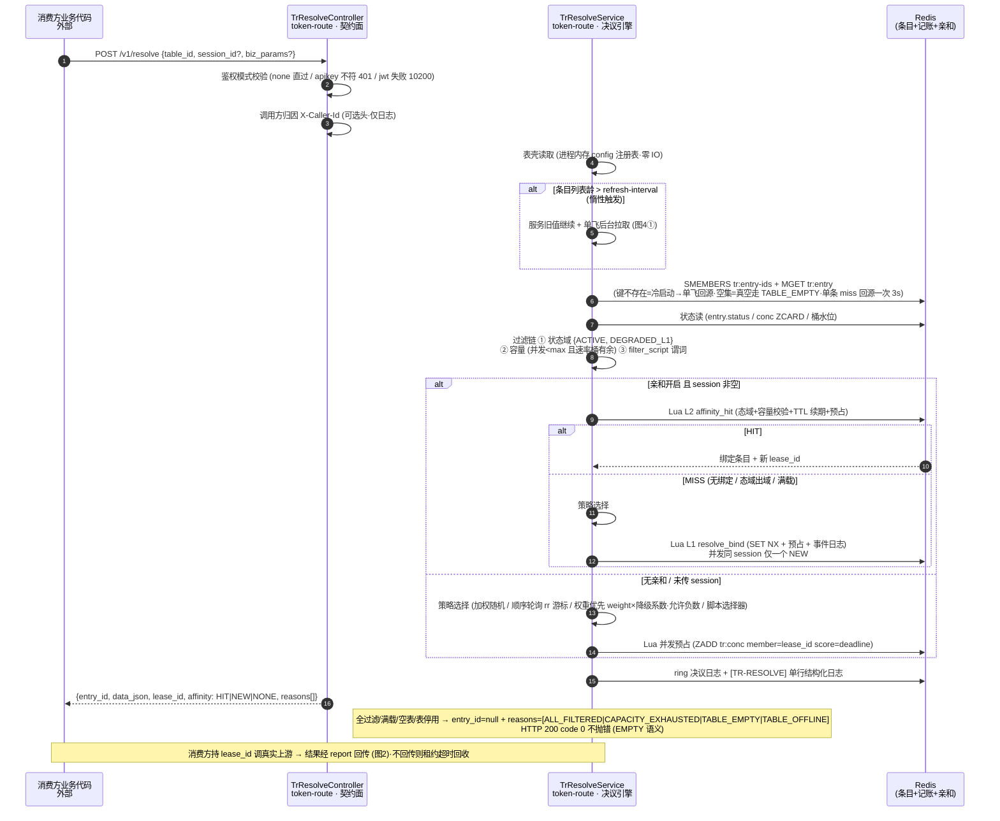
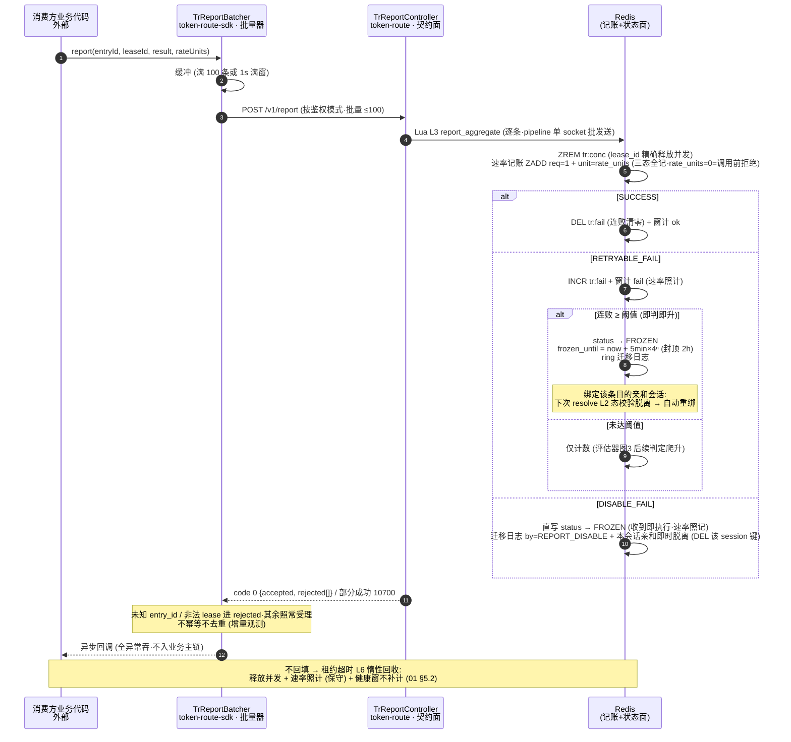
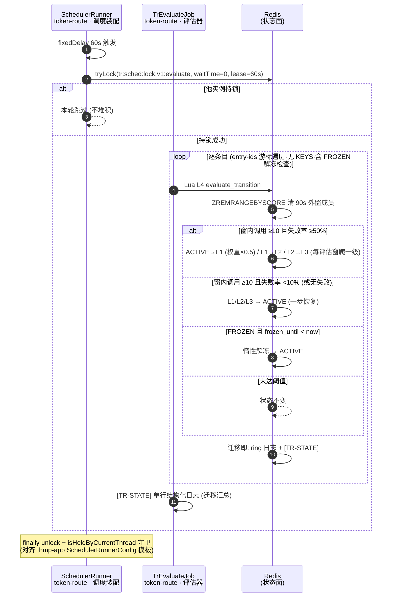
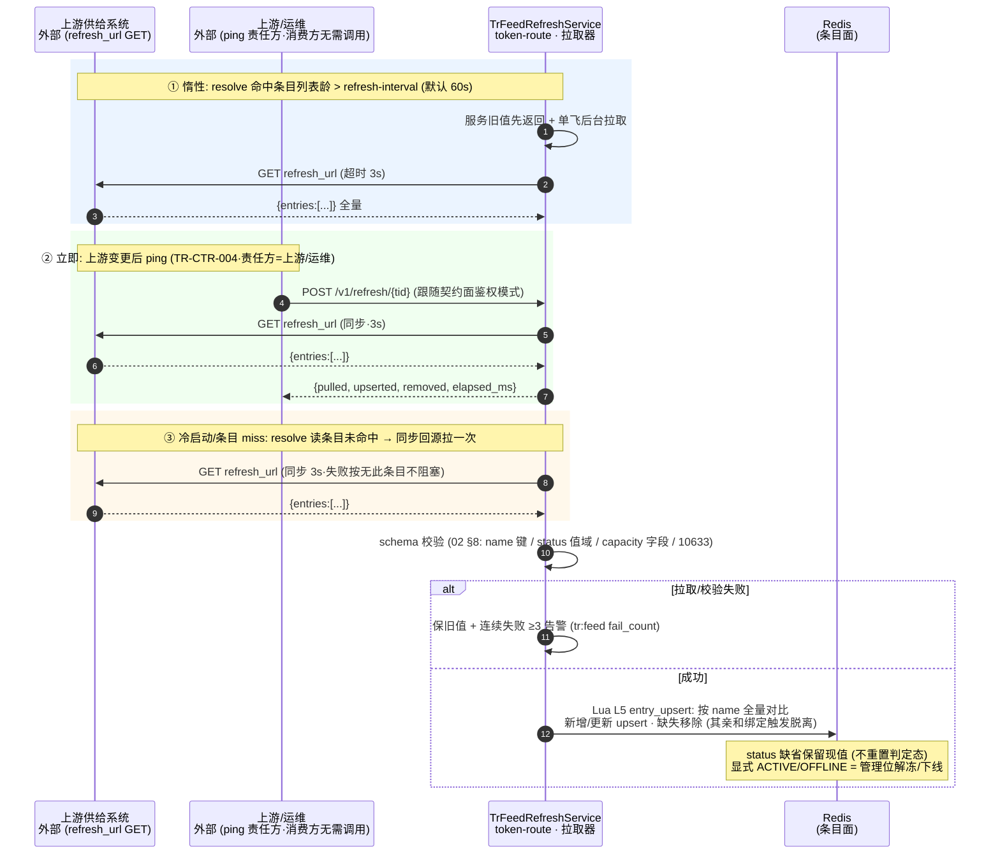
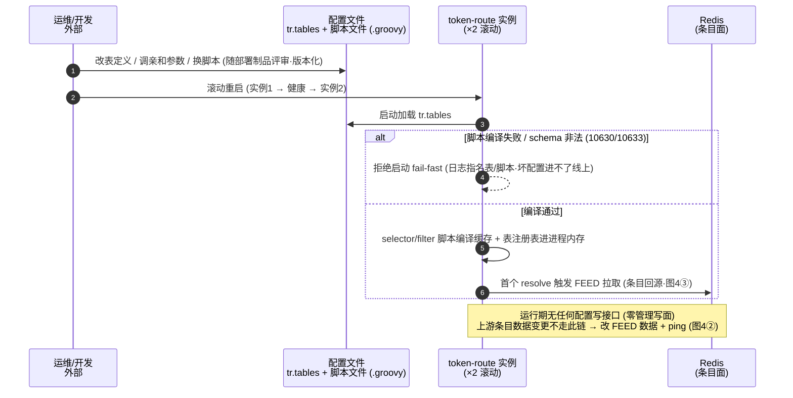
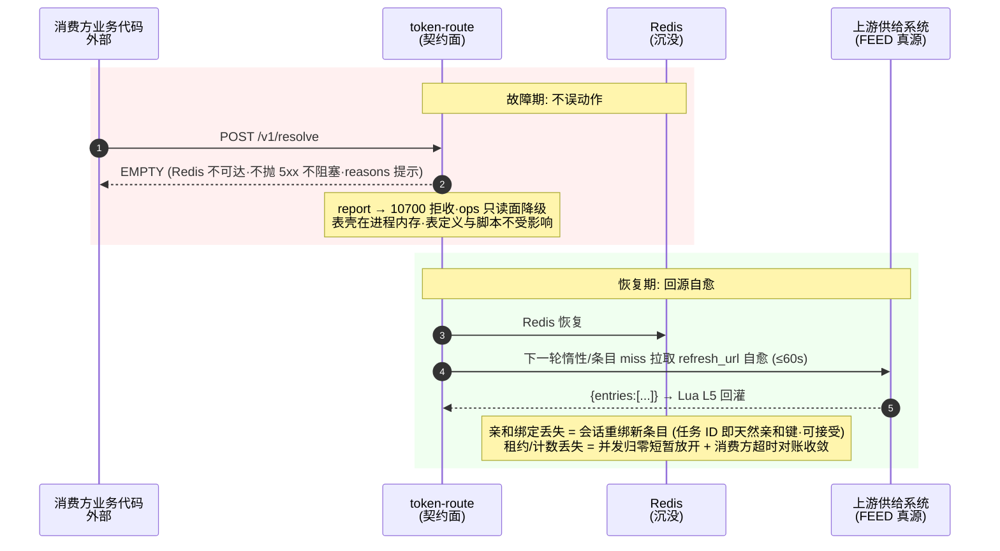

# token-route 主要流程时序图（6 条主干链路）

> 依据 01_设计方案 V2.1 / 02_接口契约 V2.1 / 03_数据设计 V2.1 整理（P0 阶段：类名为实施规划名，S0 落码时对齐）。
> 节点标注格式：`类名` + `项目 · 模块 (中文名)`。码位对齐 02 §4，键名对齐 03 §2。架构图与流程图见 `核心业务流程.md`。

## 目录

1. [resolve 决议全链路（含并发预占）](#1-resolve-决议全链路含并发预占)
2. [report 三态回填 → 记账 → 冻结判定](#2-report-三态回填--记账--冻结判定)
3. [每分钟评估器（降级爬升 / 恢复 / 惰性解冻）](#3-每分钟评估器降级爬升--恢复--惰性解冻)
4. [FEED 三触发（惰性 / 立即 / 冷启动回源）](#4-feed-三触发惰性--立即--冷启动回源)
5. [config 表定义生效链](#5-config-表定义生效链)
6. [Redis 故障自愈](#6-redis-故障自愈)

---

## 1. resolve 决议全链路（含并发预占）

02 §6 TR-CTR-001 —— 三层取数 → 过滤（状态域+容量+参数）→ 亲和 → 策略 → Lua 预占落账。

---

## 2. report 三态回填 → 记账 → 冻结判定

02 §6 TR-CTR-002 —— 批量聚合 → 精确释放租约 → 速率记账（三态全记）→ 三态状态机。

---

## 3. 每分钟评估器（降级爬升 / 恢复 / 惰性解冻）

01 §4.2 —— 爬升/恢复/解冻由定时评估驱动，Redisson 多实例锁防重入。

---

## 4. FEED 三触发（惰性 / 立即 / 冷启动回源）

01 §5.5 / 02 §8 —— 纯拉取无 push：条目数据唯一写方。

---

## 5. config 表定义生效链

01 §5.6 —— 零管理写面：表壳与脚本走部署配置，启动 fail-fast，滚动重启生效。

---

## 6. Redis 故障自愈

01 §9 —— 表壳在内存不受影响；条目/亲和/计数沉没可自愈或可接受。

