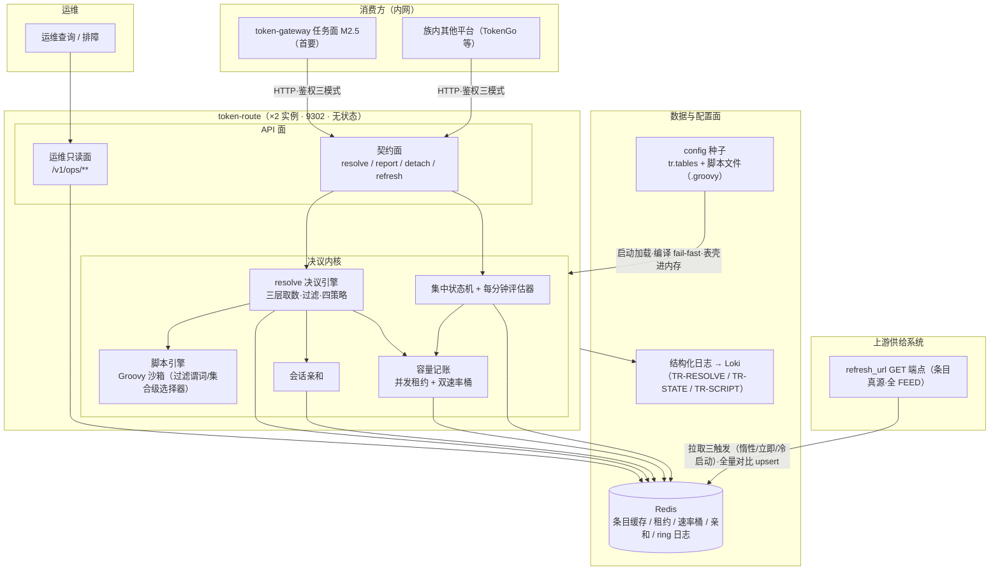
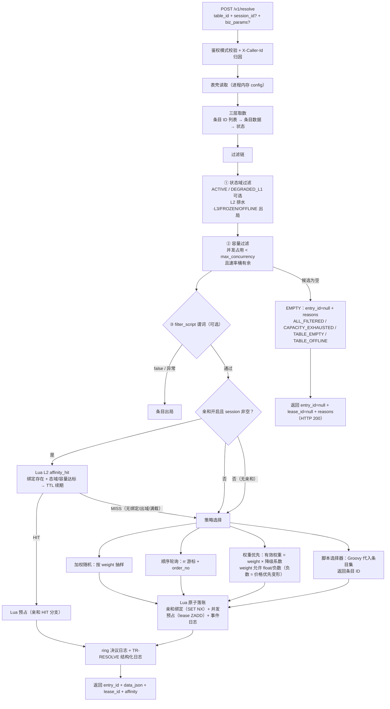
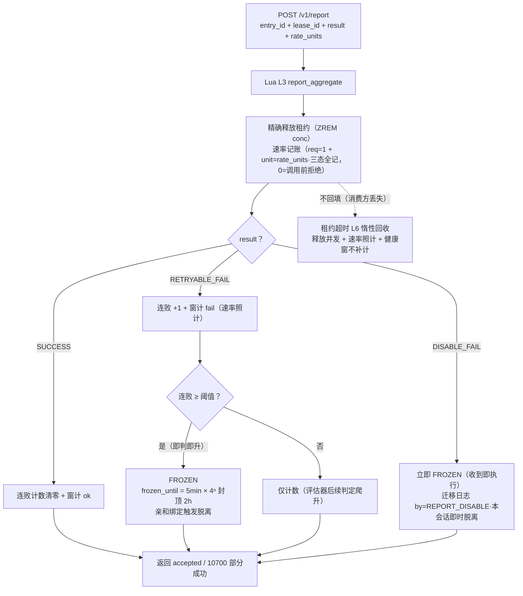
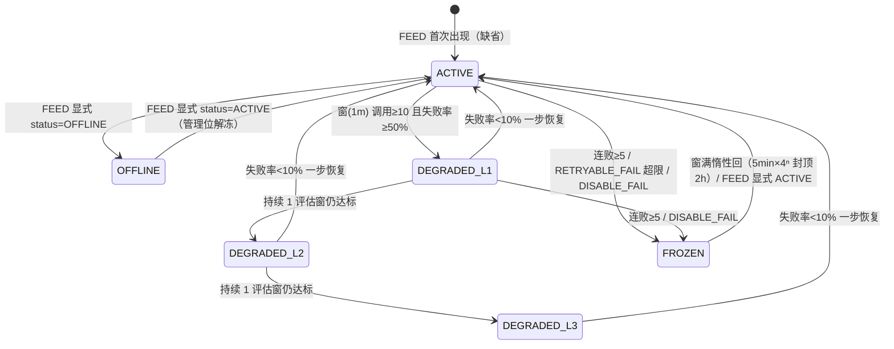
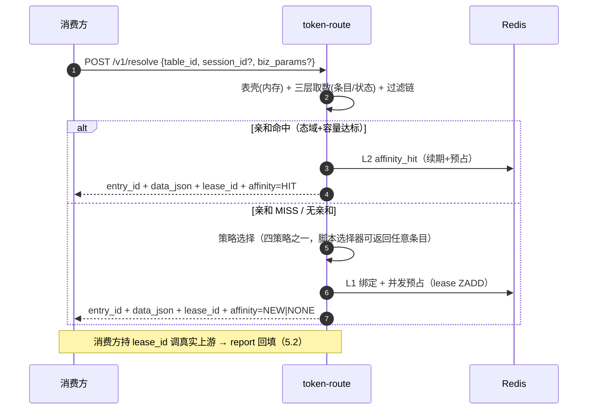
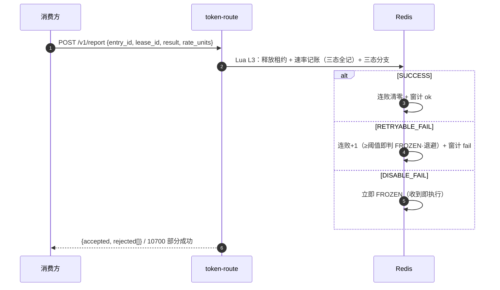
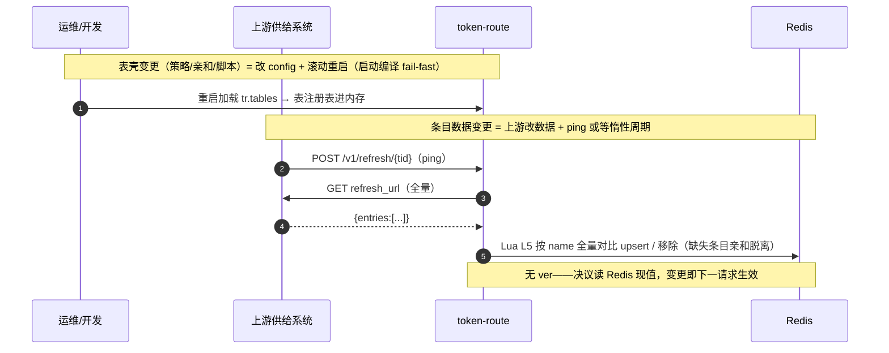

# token-route 核心业务流程（架构图 / 流程图 / 时序图）

> 依据 01_设计方案 V2.0 整理的图集入口：总体架构 → 两大核心流程图 → 条目状态机 → 关键时序。
> 全量时序（评估器 / FEED 三触发 / config 生效链 / 故障自愈）见 `04_流程时序图.md`；契约细节见 `02_接口契约.md`。

## 目录

1. [总体架构图](#1-总体架构图)
2. [核心流程一：获取路由条目（resolve + 并发预占）](#2-核心流程一获取路由条目resolve--并发预占)
3. [核心流程二：更新条目状态（report 三态回填）](#3-核心流程二更新条目状态report-三态回填)
4. [条目状态机](#4-条目状态机)
5. [关键时序图（resolve / report / FEED 生效）](#5-关键时序图)

---

## 1. 总体架构图

**架构要点**：

| 要点 | 说明 |
|---|---|
| 零管理写面 | 表壳（策略/亲和/refresh_url）与脚本全部来自 config 种子，启动加载；换表 = 改配置 + 滚动重启 |
| 全 FEED | 条目数据唯一写方 = refresh_url 拉取；Redis 只是回源缓存（真源铁律） |
| 表壳在内存 | Redis 沉没不影响表定义与脚本——故障域收窄（01 §9） |
| 双接口模型 | resolve（取条目 + 并发预占，返回 lease_id）+ report（三态回填 + 记账） |
| 边界 | 不代理流量；不做调用方/用户·key 限流（那是网关侧职责）；只做条目（上游）容量治理 |

---

## 2. 核心流程一：获取路由条目（resolve + 并发预占）

> 预占纪律：lease_id 生命周期 = 一次真实上游调用；不回传 → 租约超时（默认 30s）惰性回收——释放并发、速率照计（保守）、健康窗不补计。

---

## 3. 核心流程二：更新条目状态（report 三态回填）

---

## 4. 条目状态机

| 状态 | 参与选择 | 有效权重 | 亲和 |
|---|---|---|---|
| ACTIVE | ✅ | weight × 1 | ✅ |
| DEGRADED_L1 | ✅ | weight × 0.5 | ✅ |
| DEGRADED_L2 | ❌ 排水（存量会话继续） | — | ✅ 命中续用 |
| DEGRADED_L3 / FROZEN / OFFLINE | ❌ | — | ❌ 脱离重绑 |

> 判定参数化：`default` 预设 = 上图窗口制（**V1 唯一预设**）；`channel-legacy` 预设（连败 ≥3 → ×0.5 / 连败 ≥5 → FROZEN）**P2 交付**（表级 `state_policy`，01 §4.2）。

---

## 5. 关键时序图

### 5.1 resolve（含预占，精简版）

### 5.2 report 三态（精简版）

### 5.3 条目数据生效链（config + FEED 双真源）

