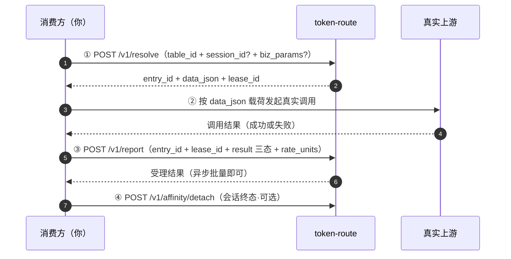

# token-route 消费方接入手册

> **本手册自包含**：只看这一份即可完成接入联调。设计依据（为什么这样设计）见 `docs/开发文档/01_设计方案.md`，字段级契约以 `docs/开发文档/02_接口契约.md` 为准——两者都是补充，不读也能接入。
> 手册版本 V2.1（对齐设计方案 V2.1）。适用对象：需要「多上游路由 + 会话亲和 + 自动降级 + 上游限速/并发治理」能力的服务的开发者。
> 同目录配套：[快速开始](./快速开始.md)（10 分钟跑通）· [FAQ](./FAQ.md)（四类 23 问）· [最佳实践](./最佳实践.md)（稳定性准则）· [配置手册](./配置手册.md)（管理方建表配置）。
> 接入方式：HTTP 直连（任意语言）或 Java SDK 薄件；服务为内网微服务（默认端口 9302），无公网面。

## 0. 五分钟了解：这个服务是什么、适不适合你

token-route **不代理你的业务流量**。它在每次真实调用上游之前回答一个问题——「**这次该用哪个上游**」，把选中条目的业务载荷（如 `base_url`）和一个**并发预占凭证（lease_id）**给你；你在调用完真实上游之后，把结果**如实回填**（report）。它据此替你做三件事：

1. **条目状态机**——某个上游连续失败会被自动降权 → 排水 → 冻结，不再分给新会话；
2. **条目容量治理**——上游声明了并发上限/限速的，满载或超速条目自动出局（这就是 lease 的用途：预占并发位）；
3. **会话亲和**——同一业务会话（如同一个转码任务）黏住同一上游，任务轮询不会打到不同实例。

**一次调用的完整生命周期**：

```text
① resolve    拿路由    → entry_id + data_json + lease_id
② 真实调用             → 按 data_json 里的载荷调用真实上游
③ report     回填结果  → 释放并发 + 速率记账 + 驱动服务端状态机
④ detach     会话终态  → （可选，亲和表建议）清理绑定
```

**适不适合你**：

| 适合 | 不适合 |
|---|---|
| 中低 QPS 的调度/任务类路由（视频转码、异步任务、通知通道等） | **高 QPS 低延迟热路径**——每次上游调用前都直连 token-route（+1 跳，resolve P99 ≤ 20ms），且 SDK 无本地缓存兜底 |
| 多上游需要自动故障切换、上游限速/并发保护 | 单一上游、无状态需求（直接配置即可，不需要本服务） |
| 同会话必须回同一上游（任务轮询/多轮对话） | |

## 1. 术语表

| 术语 | 含义 | 你需要理解到 |
|---|---|---|
| 路由表 `table_id` | 一张路由域的名字（如 `video-task-upstreams`），管理方在服务端配置中定义 | 记住你要用的表名 |
| 条目 entry | 表里的一个上游（一个渠道/一个实例）。`entry_id` 服务端生成（`e-` 前缀）；`name` 是上游系统的外部标识 | 认识 entry_id 即可 |
| `data_json` | 条目的业务载荷，服务端原样存取、**由你解释**——`base_url` 等就在这里；其中 `capacity` 是服务端唯一读取的约定字段（容量治理阈值） | **必须理解**（§4.1） |
| 租约 `lease_id` | resolve 返回的并发预占凭证，report 时必须原样回传 | **红线**（§2.2） |
| 亲和 affinity | `session_id → entry` 的绑定，让同会话黏住同条目 | 用亲和表必读（§7） |
| report 三态 | `SUCCESS` / `RETRYABLE_FAIL` / `DISABLE_FAIL`，你回填的结果分类 | **必须理解**（§4.2） |

## 2. 核心模型：lease_id 纪律与 report 义务

### 2.1 时序总览



**为什么每次调用都要 resolve**：token-route 是预占直连模式——无 SDK 缓存、无版本号比对，每次需要路由都现场决议。换来的是：容量与状态变更**下一请求即生效**，不存在「缓存吐了已脱离旧绑定」的歧义。

### 2.2 lease_id 纪律（红线，违反后果列明）

| 规则 | 违反的后果 |
|---|---|
| resolve 拿到的 `lease_id` 必须在 report 时**原样回传** | 服务端按 lease 精确释放并发位；不回传 → 该并发位要等 30s（默认 lease_ttl）超时回收才释放 |
| 一个 lease 只对应**一次**真实上游调用 | 不要一次 resolve 多个条目并行用——每个 lease 都占一个并发额度 |
| 每次**真实调用后都要 report**（成功失败都要） | 不回填 → 租约超时回收：并发最终释放，但**速率被照计（保守向，上游可能被冤枉多计）**、健康窗不补计（上游故障更晚被发现） |
| 10700（部分成功）后**只补发 rejected** 条目 | 整批重发 → accepted 部分 win/fail 双计数，污染状态机判定 |
| resolve 超时重试前，先确认上一次调用确实没发生 | 重复 resolve 各自预占一个 lease——短暂虚占 2 个并发位（30s TTL 兜底），不算错误但浪费额度 |

## 3. 接入前准备（一次性）

1. **确认鉴权模式**（与管理方核对服务端 `tr.auth.contract-mode`，token-route 不做凭证签发/轮换）：

| 模式 | 你要带什么 | 失败表现 |
|---|---|---|
| `none`（默认，内网信任） | 无鉴权头；建议带 `X-Caller-Id: <你的服务名>` 便于排障归因 | — |
| `apikey` | 每个请求带 `X-Api-Key: <共享密钥>`（管理方发放） | key 不符 → HTTP 401 |
| `jwt` | `Authorization: Bearer <JWT>`（走平台统一认证获取，token-route 只验不签） | 失败 → HTTP 200 + code 10200 |

2. **拿到 `table_id`**，并确认该表的**亲和开关**（开了亲和就必须传 `session_id`，§7）；
3. **向管理方要「参数口径」**：你的表若配了过滤/选择脚本，会读取 `biz_params` 里的特定键（如 `model` / `price` / `tenant`）——**问清楚键名与取值格式**，resolve 时照传；
4. **与上游系统对齐 `data_json` 字段语义**（载荷内容由上游 FEED 定义，本手册 §4.1 只能告诉你结构）；
5. **网络与超时**：内网直连 `http://token-route:9302`；resolve 同步返回（服务端 P99 ≤ 20ms），客户端超时建议 1~3s，超时即走降级预案；
6. **设计降级预案（接入清单强制项）**：token-route 不可用时你没有路由可用，三选一并实现（选型对比与**演练要求**见[最佳实践 §1](./最佳实践.md)）：
   - **本地兜底表**——条目载荷静态配置在本地，撑到恢复；
   - **熔断直连**——直连默认上游并做熔断保护；
   - **拒绝**——快速失败，让你的调用方重试。

## 4. 接口详解（四个，消费方常用三个）

### 4.1 resolve —— 取路由 + 并发预占

**何时调用**：每次真实上游调用前，一次。

`POST /v1/resolve`

请求字段：

| 字段 | 必填 | 说明 |
|---|---|---|
| `table_id` | 是 | 路由表名。未注册 → 10400；表被停用 → EMPTY + `TABLE_OFFLINE` |
| `session_id` | 表开亲和时必填 | 亲和键，≤128 字符，用业务天然 ID（任务 ID / 会话 ID） |
| `biz_params` | 否 | 业务参数（≤64 键，值 string/number），供表上脚本过滤/选择用（键名见 §3.3） |

响应 `data` 字段：

| 字段 | 说明 |
|---|---|
| `entry_id` | 选中条目 ID；EMPTY 时为 null |
| `data_json` | 条目业务载荷（见下） |
| `lease_id` | 并发预占凭证（§2.2 红线）；EMPTY 时为 null |
| `affinity` | `HIT`（同会话续用原条目）/ `NEW`（新建绑定）/ `NONE`（表未开亲和或未传 session） |
| `reasons` | EMPTY 时的原因码数组（§8.2） |

**data_json 里有什么**：除 `capacity` 外**完全由上游系统定义、原样透传**——`base_url` / `api_path` / 模型清单 / 价格等都可能在这里，字段语义找上游系统对齐（§3.4）。`capacity` 是服务端读取的容量声明：

| capacity 字段 | 含义 | 对你的影响 |
|---|---|---|
| `max_concurrency` | 上游并发上限 | 满载条目自动出局，你无感 |
| `rate_limit_value` / `rate_window_ms` | 窗口限速量 / 窗口长度 | 超速条目对新调用出局，你无感 |
| `rate_unit` | 计量口径：`REQUEST` / `TOKEN` / `BIT` | **决定你 report 时 `rate_units` 的单位**（§4.2） |

**EMPTY 不是错误**：HTTP 200 + code 0 + `entry_id=null`。这是正常业务分支，按 `reasons` 处置（§8.2），不要当异常抛。

### 4.2 report —— 回填结果（三态判定指南）

**何时调用**：每次真实上游调用后，一次（异步批量即可，SDK 已内置）。

`POST /v1/report`，body 为 `reports[]`（1~100 条）：

| 字段 | 必填 | 说明 |
|---|---|---|
| `entry_id` | 是 | resolve 返回的条目 |
| `lease_id` | 是 | resolve 返回的凭证，**原样回传** |
| `result` | 是 | 三态之一，判定指南见下 |
| `rate_units` | 否 | 默认 1。速率记账量，口径见下表 |
| `latency_ms` | 否 | 观测用 |
| `session_id` | 否 | `DISABLE_FAIL` 时建议带——服务端会**即时**解除该会话的亲和绑定 |

**三态判定指南**（本手册最重要的对接口径）：

| 你遇到的情况 | result | 为什么 |
|---|---|---|
| 上游正常受理且业务成功 | `SUCCESS` | 连败清零 |
| 连接失败 / 读超时 / HTTP 5xx / 429 / 503 | `RETRYABLE_FAIL` | 稍后或换条目可能成功——计入失败率与连败，服务端自动降级/冻结 |
| 上游明确拒绝且**对该条目是持续性的**：模型/能力不支持、API 路径不存在、渠道凭证被封或欠费、地区不服务 | `DISABLE_FAIL` | 强信号：该条目对你的业务确认不可用，服务端**立即 FROZEN**（所有消费方不再选中它）。仅持续性不可用使用 |
| 调用前就被你本地拒绝（载荷校验不过，请求没发出去） | `DISABLE_FAIL` + `rate_units=0` | 未消耗上游资源，速率记 0 |

> **拿不准就用 `RETRYABLE_FAIL`**——它是保守态（条目被降权但保留）。`DISABLE_FAIL` 是重锤：误用会误伤其他消费方（ops 面可追溯来源）。

**rate_units 怎么填**（口径由**本次返回条目**的 `capacity.rate_unit` 决定，同表不同条目可不同）：

| rate_unit | rate_units 填什么 | 示例 |
|---|---|---|
| `REQUEST`（默认） | 恒 1（按次） | 1 |
| `TOKEN` | 本次调用消耗的 token 数 | 1536 |
| `BIT` | 本次传输的比特数（字节数 × 8） | 122880 |
| （调用前拒绝，任意口径） | 0 | 0 |

**响应**：全部受理 → code 0 `{accepted: N, rejected: []}`；存在拒收（未知 entry_id / 非法或迟到的 lease）→ **10700**，`data.rejected[]` 有明细——**只补发 rejected**；迟到（>lease_ttl）的条目不用补，回收时速率已照计。

### 4.3 detach —— 会话终态清理

`POST /v1/affinity/detach`，body `{"table_id": "...", "session_id": "..."}` → `{"detached": true | false}`。

- 幂等，可重复调；不调也不会出错（绑定空闲 8h 默认后自动过期）；
- **亲和表建议会话终态必调**：及时释放绑定，会话 ID 可安全复用。

### 4.4 refresh —— 通常与你无关

`POST /v1/refresh/{tid}` 是上游系统/运维在条目数据变更后的「立即生效」按钮。消费方**不需要调用**。

## 5. HTTP 直连完整走查（curl）

以视频转码任务表 `video-task-upstreams` 为例，一个任务从启动到终态的完整交互（`none` 鉴权模式；`apikey` 模式每个请求追加 `-H "X-Api-Key: $TR_API_KEY"`）：

```bash
BASE=http://token-route:9302

# ① 任务启动：取路由（session_id = 任务 ID，亲和保证后续轮询回同一上游）
curl -s -X POST $BASE/v1/resolve -H "Content-Type: application/json" -H "X-Caller-Id: video-worker" \
  -d '{"table_id":"video-task-upstreams","session_id":"task-20260831-0001","biz_params":{"codec":"h265"}}'
# → {"code":0,"data":{"entry_id":"e-3f9c2a",
#     "data_json":{"base_url":"https://up-a.example.com","api_path":"/v1/transcode",
#                  "capacity":{"max_concurrency":20,"rate_unit":"REQUEST"}},
#     "lease_id":"9f2a7c…","affinity":"NEW","reasons":[]},"trace_id":"…"}

# ② 用载荷调用真实上游（本例读超时失败）
#    POST https://up-a.example.com/v1/transcode … → read timeout

# ③ 如实回填失败（保守态）
curl -s -X POST $BASE/v1/report -H "Content-Type: application/json" \
  -d '{"reports":[{"entry_id":"e-3f9c2a","lease_id":"9f2a7c…","result":"RETRYABLE_FAIL","rate_units":1,"session_id":"task-20260831-0001"}]}'
# → {"code":0,"data":{"accepted":1,"rejected":[]}}

# ④ 任务要立刻继续：亲和还黏着失败条目（连败未达脱离阈值）→ 先 detach 强制重绑
curl -s -X POST $BASE/v1/affinity/detach -H "Content-Type: application/json" \
  -d '{"table_id":"video-task-upstreams","session_id":"task-20260831-0001"}'
# → {"code":0,"data":{"detached":true}}
# 再 resolve —— 刚失败的条目已计一次连败/失败率，状态机与容量过滤会自然避开它
curl -s -X POST $BASE/v1/resolve -H "Content-Type: application/json" \
  -d '{"table_id":"video-task-upstreams","session_id":"task-20260831-0001","biz_params":{"codec":"h265"}}'
# → entry_id="e-77b1de"（另一条目）, lease_id="aa31b0…", affinity="NEW"

# ⑤ 这次调用成功 → 回填成功
curl -s -X POST $BASE/v1/report -H "Content-Type: application/json" \
  -d '{"reports":[{"entry_id":"e-77b1de","lease_id":"aa31b0…","result":"SUCCESS","rate_units":1}]}'

# ⑥ 任务终态：清理亲和
curl -s -X POST $BASE/v1/affinity/detach -H "Content-Type: application/json" \
  -d '{"table_id":"video-task-upstreams","session_id":"task-20260831-0001"}'
```

> 六步之外最简路径：① resolve → ② 真实调用 → ③ report，三步即可跑通；`detach` 亲和表建议补上。

## 6. Java SDK 接入

```xml
<dependency>
  <groupId>fun.commons</groupId>
  <artifactId>token-route-sdk</artifactId>
</dependency>
```

```yaml
tr:
  client:
    base-url: http://token-route:9302
    api-key: ${TR_API_KEY:}      # 仅 apikey 模式；none 留空；jwt 模式配 token 获取方式
    report-batch-size: 100       # 回填缓冲（满 100 条或 1s 刷一次）
```

```java
TrRouteClient client = TrRouteClient.create(properties);

// ① 取路由：亲和表必须传 sessionId（任务 ID 即天然亲和键）
ResolveResult r = client.resolve("video-task-upstreams", "task-20260831-0001", bizParams);
if (r.isEmpty()) {
    // 这不是异常：按 r.getReasons() 处置（§8.2）——退避重试 / 走降级预案
    throw new NoUpstreamAvailableException(r.getReasons());
}

// ② 用 dataJson 里的业务载荷发起真实调用（leaseId 放进调用上下文，③ 要用）
UpstreamEntry up = r.getEntry();   // entryId + dataJson(Map) + leaseId

// ③ 回填（异步批量，异常全吞不入业务主链）
client.report(up.getEntryId(), r.getLeaseId(), Result.SUCCESS, 1, "task-20260831-0001");

// ④ 会话终态（亲和表建议）
client.detach("video-task-upstreams", "task-20260831-0001");
```

SDK 行为须知：

- **无本地缓存**（预占直连模式）：每次 `resolve` 都是真实网络调用；token-route 不可用 → 抛错/EMPTY，走你的降级预案；
- report 异步批量（满 100 条或 1s 刷一次）；应用关停前建议 flush 批缓冲，避免尾部回填丢失；
- lease_id 透传纪律与 HTTP 直连完全相同（§2.2）。

## 7. 会话亲和（开了亲和的表必读）

- **session_id 怎么选**：业务天然 ID（任务 ID / 会话 ID），≤128 字符；同一会话的所有请求带同一个值——换了值 = 换了会话，亲和失效；
- **affinity 三值**：`HIT` = 黏住原条目续用；`NEW` = 新建绑定（首次或重绑后）；`NONE` = 表未开亲和或你没传 session_id；
- **自动脱离重绑的四种情形**（你无需处理，下次 resolve 自动换条目）：
  1. 空闲超时（默认 8h，表级可配）；
  2. 绑定条目连败达阈值（默认 5 次）；
  3. 条目被冻结 / 下线 / 满载；
  4. 你调用了 detach。
- **重要推论——立即 failover 要先 detach**：单次失败后条目往往还是 ACTIVE，同 session 直接再 resolve 仍会 `HIT` 原条目（§5 走查第 ④ 步）。要立刻换条目：`detach` → `resolve`；
- **不要在本地缓存「session → entry」映射**：服务端可能已重绑，绑定状态以每次 resolve 的返回为准。

## 8. 失败处理与降级

### 8.1 错误码总表

| 现象 | 含义 | 处置 |
|---|---|---|
| HTTP 401 | apikey 模式 `X-Api-Key` 不符（服务端轮换了 key？） | 与管理方对齐 key |
| code 10200 | jwt 模式 token 失效 | 重新走平台认证获取 |
| code 10100 / 10101 | 参数错误 / 必填缺失（reports 超过 100 条也是 10100） | 检查请求体 |
| code 10400 | table_id 未注册 | 找管理方核对表名 |
| code 10700（report） | 批量部分成功 | **只补发 `rejected[]` 条目**；迟到条目不用补 |
| code 0 但 entry_id=null | EMPTY——**不是错误** | 按 reasons 处置（§8.2） |
| 网络超时 / 连接拒绝 | token-route 不可用 | 走你的降级预案（§3.6）；**不要疯狂重试 resolve** |

### 8.2 EMPTY reasons 处置表

| reason | 含义 | 建议处置 |
|---|---|---|
| `ALL_FILTERED` | 条目被状态域/过滤脚本全部排除 | 检查 `biz_params` 是否符合表口径（§3.3）；稍后重试 |
| `CAPACITY_EXHAUSTED` | 有候选但全部满载/超速 | 退避后重试；持续出现 → 找管理方调 capacity 或扩上游 |
| `TABLE_EMPTY` | 表内没有条目 | 上游 FEED 未配置或为空——找管理方 |
| `TABLE_OFFLINE` | 表被停用 | 找管理方确认是否计划内停用 |
| `SCRIPT_DEGRADED` | 选择器脚本故障已回退（或无策略可用） | 告警管理方（服务端有 SLI 计数）；可稍后重试 |

### 8.3 failover 正确姿势

- 没有 fallbacks 字段——**重新 resolve 就是 failover**：刚失败的条目已计入连败/失败率，服务端状态机与容量过滤会自动避开它；
- 亲和表上立即换条目 = `detach` → `resolve`（§7）；
- 连续失败不需要你摘除条目——`RETRYABLE_FAIL` 持续上报，服务端自动 降权 → 排水 → 冻结。

## 9. 常见陷阱速查

> 接入类高频陷阱速查表；更全的问题库（一般/接入/运行时/运维 23 问）见同目录 [FAQ.md](./FAQ.md)。

| 症状 | 根因 | 正确做法 |
|---|---|---|
| 上游总被「冤枉」限速 | report 漏发（lease 超时回收时速率照计） | 每次真实调用后必 report；SDK 关停前 flush 批缓冲 |
| 失败后 resolve 还回同一条目 | 亲和黏住（连败未达脱离阈值） | 立即换条目 = detach → resolve（§7） |
| 并发额度莫名少了一截 | resolve 超时重试（双 lease 虚占） | 重试前确认上次未发生；30s 后自动恢复 |
| 服务端状态机判定异常 | 10700 后整批重发（win/fail 双计） | 只补发 rejected |
| TOKEN/BIT 表限速不准 | rate_units 按次填了 1 | 按条目 `capacity.rate_unit` 口径填实际值（§4.2） |
| 别的消费方突然拿不到某条目 | 你误用了 `DISABLE_FAIL`（立即全局 FROZEN） | 只对持续性不可用使用；偶发失败用 `RETRYABLE_FAIL` |
| 任务轮询打到不同上游实例 | 没传 session_id 或每次换值 | 亲和表必须带稳定 session_id |
| 条目明明正常却被跳过 | 曾被（任何消费方的）DISABLE_FAIL 冻结，或容量满载 | 找管理方查 ops 面 state-logs 与 conc_active；FEED 显式 ACTIVE 可解冻 |

## 10. 接入自查清单（上线前逐项打勾）

| # | 检查项 |
|---|---|
| 1 | 已与管理方确认鉴权模式并验证通过（none 直连成功 / apikey 头正确 / jwt 获取链路通） |
| 2 | 已拿到 table_id，并确认该表亲和开关（开了 → 所有请求带稳定 session_id） |
| 3 | 已问清 `biz_params` 参数口径（表配了脚本时），resolve 按口径传参 |
| 4 | 已与上游系统对齐 data_json 字段语义（base_url 等如何解释） |
| 5 | resolve 客户端超时已设（建议 1~3s），失败走降级预案（不是无限重试） |
| 6 | **降级预案已实现并演练过**（本地兜底表 / 熔断直连 / 拒绝，三选一） |
| 7 | lease_id 全链透传：resolve 返回 → 调用上下文 → report 入参（日志可对上） |
| 8 | 三态判定逻辑评审过（拿不准用 RETRYABLE_FAIL；DISABLE_FAIL 有明确情形清单） |
| 9 | rate_units 口径按条目 capacity.rate_unit（TOKEN/BIT 表传实际值；调用前拒绝传 0） |
| 10 | 10700 处理 = 只补发 rejected |
| 11 | 亲和表：会话终态调 detach；立即 failover = detach → resolve |
| 12 | 请求带 X-Caller-Id；异常时报 trace_id 给管理方可联查 |

## 11. 联调与排障支持

- 每个响应带 `trace_id`（响应头 `X-Trace-Id` 与 body 双通道）——联调/排障时报给管理方，可联查服务端决议日志（`[TR-RESOLVE]` 标记）；
- 服务端有只读运维面（表/条目实时状态、决议日志、亲和事件、状态迁移史），由管理方操作——你只需提供 `table_id` / `entry_id` / `session_id` / `trace_id` / 大致时间即可定位问题；
- 契约细节有出入时，以 `docs/开发文档/02_接口契约.md` 为准并反馈管理方。
